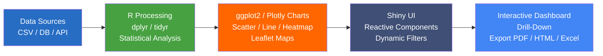

# Data Visualization Dashboard R


Dashboard interativo de visualização de dados construído em R com Shiny, oferecendo análise estatística avançada, gráficos dinâmicos e relatórios automatizados para exploração de dados empresariais.

## 🎯 Visão Geral

Aplicação Shiny completa para visualização e análise de dados que combina o poder estatístico do R com interfaces web interativas para criar dashboards profissionais e responsivos.



### ✨ Características Principais

- **📊 Visualizações Avançadas**: ggplot2, plotly, leaflet para mapas
- **🔄 Interatividade**: Filtros dinâmicos e drill-down
- **📈 Análise Estatística**: Modelos, testes e métricas
- **📱 Design Responsivo**: Flexdashboard e shinydashboard
- **📋 Relatórios**: R Markdown automatizados
- **💾 Export**: PDF, HTML, Excel

## 🛠️ Stack Tecnológico

### Core R Packages
- **Shiny**: Framework web interativo
- **ggplot2**: Grammar of graphics
- **plotly**: Gráficos interativos
- **dplyr**: Manipulação de dados

### Visualização Avançada
- **leaflet**: Mapas interativos
- **DT**: Tabelas interativas
- **visNetwork**: Gráficos de rede
- **corrplot**: Matrizes de correlação

### Dashboard e Layout
- **shinydashboard**: Dashboards profissionais
- **flexdashboard**: Layouts responsivos
- **shinyWidgets**: Widgets customizados
- **shinycssloaders**: Indicadores de carregamento

### Análise e Relatórios
- **rmarkdown**: Relatórios dinâmicos
- **knitr**: Documentos reproduzíveis
- **forecast**: Séries temporais
- **caret**: Machine learning

## 📁 Estrutura do Projeto

```
Data-Visualization-Dashboard-R/
├── app/                            # Aplicação Shiny
│   ├── ui.R                        # Interface do usuário
│   ├── server.R                    # Lógica do servidor
│   ├── global.R                    # Configurações globais
│   └── modules/                    # Módulos Shiny
│       ├── data_module.R           # Módulo de dados
│       ├── chart_module.R          # Módulo de gráficos
│       ├── filter_module.R         # Módulo de filtros
│       └── export_module.R         # Módulo de export
├── R/                              # Funções R
│   ├── data_processing.R           # Processamento de dados
│   ├── visualization_functions.R   # Funções de visualização
│   ├── statistical_analysis.R     # Análise estatística
│   └── utils.R                     # Funções utilitárias
├── data/                           # Datasets
│   ├── raw/                        # Dados brutos
│   ├── processed/                  # Dados processados
│   └── sample/                     # Dados de exemplo
├── reports/                        # Relatórios R Markdown
│   ├── dashboard_report.Rmd        # Relatório principal
│   ├── statistical_report.Rmd     # Relatório estatístico
│   └── executive_summary.Rmd      # Resumo executivo
├── www/                            # Arquivos web estáticos
│   ├── css/                        # Estilos CSS
│   ├── js/                         # JavaScript customizado
│   └── images/                     # Imagens e ícones
├── tests/                          # Testes automatizados
├── main.R                          # Script principal
├── .gitignore                      # Arquivos ignorados
└── README.md                       # Documentação
```

## 🚀 Quick Start

### Pré-requisitos

- R 4.3+
- RStudio (recomendado)

### Instalação

1. **Clone o repositório:**
```bash
git clone https://github.com/galafis/Data-Visualization-Dashboard-R.git
cd Data-Visualization-Dashboard-R
```

2. **Instale os pacotes necessários:**
```r
# Instalar pacotes principais
install.packages(c(
  "shiny", "shinydashboard", "ggplot2", "plotly", "dplyr",
  "DT", "leaflet", "flexdashboard", "rmarkdown", "knitr"
))
```

3. **Execute a aplicação:**
```r
# Executar aplicação Shiny
shiny::runApp("app")

# Ou executar script principal
source("main.R")
```

4. **Acesse o dashboard:**
```
http://localhost:3838
```

## 📊 Componentes do Dashboard

### Interface Principal (ui.R)
```r
library(shiny)
library(shinydashboard)

dashboardPage(
  dashboardHeader(title = "Data Visualization Dashboard"),
  
  dashboardSidebar(
    sidebarMenu(
      menuItem("Overview", tabName = "overview", icon = icon("dashboard")),
      menuItem("Analytics", tabName = "analytics", icon = icon("chart-line")),
      menuItem("Reports", tabName = "reports", icon = icon("file-alt"))
    )
  ),
  
  dashboardBody(
    tabItems(
      tabItem(tabName = "overview",
        fluidRow(
          valueBoxOutput("total_records"),
          valueBoxOutput("avg_value"),
          valueBoxOutput("growth_rate")
        ),
        fluidRow(
          box(title = "Trend Analysis", status = "primary", 
              solidHeader = TRUE, width = 8,
              plotlyOutput("trend_plot")),
          box(title = "Distribution", status = "warning",
              solidHeader = TRUE, width = 4,
              plotOutput("distribution_plot"))
        )
      )
    )
  )
)
```

### Lógica do Servidor (server.R)
```r
library(shiny)
library(ggplot2)
library(plotly)

server <- function(input, output, session) {
  
  # Dados reativos
  data <- reactive({
    # Carregar e processar dados
    load_and_process_data()
  })
  
  # Value boxes
  output$total_records <- renderValueBox({
    valueBox(
      value = nrow(data()),
      subtitle = "Total Records",
      icon = icon("database"),
      color = "blue"
    )
  })
  
  # Gráfico de tendência
  output$trend_plot <- renderPlotly({
    p <- ggplot(data(), aes(x = date, y = value)) +
      geom_line(color = "#3498db", size = 1.2) +
      geom_smooth(method = "loess", se = FALSE, color = "#e74c3c") +
      theme_minimal() +
      labs(title = "Trend Analysis", x = "Date", y = "Value")
    
    ggplotly(p)
  })
  
  # Gráfico de distribuição
  output$distribution_plot <- renderPlot({
    ggplot(data(), aes(x = category, fill = category)) +
      geom_bar() +
      theme_minimal() +
      theme(legend.position = "none") +
      labs(title = "Category Distribution")
  })
}
```

## 📈 Visualizações Avançadas

### Gráficos Interativos com Plotly
```r
library(plotly)

create_interactive_scatter <- function(data) {
  p <- ggplot(data, aes(x = x, y = y, color = category, text = paste("ID:", id))) +
    geom_point(alpha = 0.7, size = 3) +
    theme_minimal() +
    labs(title = "Interactive Scatter Plot")
  
  ggplotly(p, tooltip = "text") %>%
    layout(
      hovermode = "closest",
      showlegend = TRUE
    )
}
```

### Mapas Interativos com Leaflet
```r
library(leaflet)

create_interactive_map <- function(locations_data) {
  leaflet(locations_data) %>%
    addTiles() %>%
    addCircleMarkers(
      lng = ~longitude,
      lat = ~latitude,
      radius = ~sqrt(value) * 2,
      popup = ~paste("Location:", name, "<br>Value:", value),
      color = ~colorNumeric("viridis", value)(value),
      fillOpacity = 0.7
    ) %>%
    addLegend(
      position = "bottomright",
      pal = colorNumeric("viridis", locations_data$value),
      values = ~value,
      title = "Value Scale"
    )
}
```

### Heatmaps de Correlação
```r
library(corrplot)

create_correlation_heatmap <- function(data) {
  # Calcular matriz de correlação
  cor_matrix <- cor(select_if(data, is.numeric), use = "complete.obs")
  
  # Criar heatmap interativo
  plot_ly(
    z = cor_matrix,
    x = colnames(cor_matrix),
    y = rownames(cor_matrix),
    type = "heatmap",
    colorscale = "RdBu",
    zmid = 0
  ) %>%
    layout(
      title = "Correlation Heatmap",
      xaxis = list(title = "Variables"),
      yaxis = list(title = "Variables")
    )
}
```

## 📊 Análise Estatística

### Análise Descritiva
```r
perform_descriptive_analysis <- function(data) {
  summary_stats <- data %>%
    select_if(is.numeric) %>%
    summarise_all(list(
      mean = ~mean(., na.rm = TRUE),
      median = ~median(., na.rm = TRUE),
      sd = ~sd(., na.rm = TRUE),
      min = ~min(., na.rm = TRUE),
      max = ~max(., na.rm = TRUE)
    ))
  
  return(summary_stats)
}
```

### Testes Estatísticos
```r
perform_statistical_tests <- function(data, group_var, value_var) {
  # Teste t para duas amostras
  if (length(unique(data[[group_var]])) == 2) {
    t_test_result <- t.test(
      data[[value_var]] ~ data[[group_var]], 
      data = data
    )
    return(t_test_result)
  }
  
  # ANOVA para múltiplos grupos
  anova_result <- aov(
    as.formula(paste(value_var, "~", group_var)), 
    data = data
  )
  return(summary(anova_result))
}
```

## 📋 Relatórios Automatizados

### Template R Markdown
```markdown
---
title: "Dashboard Analytics Report"
author: "Gabriel Demetrios Lafis"
date: "`r Sys.Date()`"
output: 
  html_document:
    toc: true
    toc_float: true
    theme: flatly
    code_folding: hide
params:
  data_file: "data/processed/analysis_data.csv"
  date_range: !r c(Sys.Date() - 30, Sys.Date())
---

## Executive Summary

```{r setup, include=FALSE}
knitr::opts_chunk$set(echo = TRUE, warning = FALSE, message = FALSE)
library(ggplot2)
library(dplyr)
library(plotly)

# Carregar dados
data <- read.csv(params$data_file)
```

### Key Metrics

```{r metrics}
# Calcular métricas principais
total_records <- nrow(data)
avg_value <- mean(data$value, na.rm = TRUE)
growth_rate <- calculate_growth_rate(data)

# Exibir métricas
cat("Total Records:", total_records, "\n")
cat("Average Value:", round(avg_value, 2), "\n")
cat("Growth Rate:", paste0(round(growth_rate * 100, 1), "%"), "\n")
```

### Visualizations

```{r plots, fig.width=10, fig.height=6}
# Gráfico de tendência
trend_plot <- ggplot(data, aes(x = date, y = value)) +
  geom_line(color = "#3498db") +
  geom_smooth(method = "loess", se = FALSE, color = "#e74c3c") +
  theme_minimal() +
  labs(title = "Trend Analysis", x = "Date", y = "Value")

print(trend_plot)
```
```

### Flexdashboard Layout
```r
---
title: "Executive Dashboard"
output: 
  flexdashboard::flex_dashboard:
    orientation: columns
    vertical_layout: fill
    theme: bootstrap
---

```{r setup, include=FALSE}
library(flexdashboard)
library(ggplot2)
library(plotly)
library(DT)
```

Column {data-width=650}
-----------------------------------------------------------------------

### Trend Analysis

```{r}
# Gráfico principal
trend_plot <- ggplot(data, aes(x = date, y = value)) +
  geom_line() +
  theme_minimal()

ggplotly(trend_plot)
```

Column {data-width=350}
-----------------------------------------------------------------------

### Key Metrics

```{r}
valueBox(
  value = paste0(round(growth_rate * 100, 1), "%"),
  caption = "Growth Rate",
  icon = "fa-arrow-up",
  color = "success"
)
```

### Data Table

```{r}
DT::datatable(
  data,
  options = list(pageLength = 10, scrollX = TRUE),
  filter = "top"
)
```
```

## 🔧 Módulos Shiny Reutilizáveis

### Módulo de Filtros
```r
# UI do módulo
filterUI <- function(id) {
  ns <- NS(id)
  
  tagList(
    selectInput(ns("category"), "Category:", choices = NULL),
    dateRangeInput(ns("date_range"), "Date Range:"),
    numericRangeInput(ns("value_range"), "Value Range:", value = c(0, 100))
  )
}

# Server do módulo
filterServer <- function(id, data) {
  moduleServer(id, function(input, output, session) {
    
    # Atualizar choices baseado nos dados
    observe({
      updateSelectInput(session, "category", 
                       choices = unique(data()$category))
    })
    
    # Retornar dados filtrados
    filtered_data <- reactive({
      data() %>%
        filter(
          category %in% input$category,
          date >= input$date_range[1],
          date <= input$date_range[2],
          value >= input$value_range[1],
          value <= input$value_range[2]
        )
    })
    
    return(filtered_data)
  })
}
```

## 🧪 Testes e Validação

### Executar Testes
```bash
# Testes automatizados
Rscript tests/test_functions.R

# Testes de módulos Shiny
Rscript tests/test_modules.R
```

### Exemplo de Teste
```r
library(testthat)

test_that("data processing works correctly", {
  sample_data <- data.frame(
    x = 1:10,
    y = rnorm(10),
    category = rep(c("A", "B"), 5)
  )
  
  result <- process_data(sample_data)
  
  expect_equal(nrow(result), 10)
  expect_true("processed" %in% names(result))
})
```

## 📊 Casos de Uso Práticos

### 1. Dashboard Executivo
- KPIs em tempo real
- Métricas de performance
- Análise de tendências

### 2. Análise de Vendas
- Performance por região
- Análise de produtos
- Previsão de demanda

### 3. Monitoramento Operacional
- Métricas de qualidade
- Indicadores de processo
- Alertas automáticos

## 📄 Licença

Este projeto está licenciado sob a Licença MIT - veja o arquivo [LICENSE](LICENSE) para detalhes.

## 👨‍💻 Autor

**Gabriel Demetrios Lafis**

- GitHub: [@galafis](https://github.com/galafis)
- Email: gabrieldemetrios@gmail.com

---

⭐ Se este projeto foi útil, considere deixar uma estrela!


---

## English

### Overview

Data Visualization Dashboard R - A project built with R, JavaScript, Java, HTML, CSS, developed by Gabriel Demetrios Lafis as part of professional portfolio and continuous learning in Data Science and Software Engineering.

### Key Features

This project demonstrates practical application of modern development concepts including clean code architecture, responsive design patterns, and industry-standard best practices. The implementation showcases real-world problem solving with production-ready code quality.

### How to Run

1. Clone the repository:
   ```bash
   git clone https://github.com/galafis/Data-Visualization-Dashboard-R.git
   ```
2. Follow the setup instructions in the Portuguese section above.

### License

This project is licensed under the MIT License. See the [LICENSE](LICENSE) file for details.

---

Developed by [Gabriel Demetrios Lafis](https://github.com/galafis)
